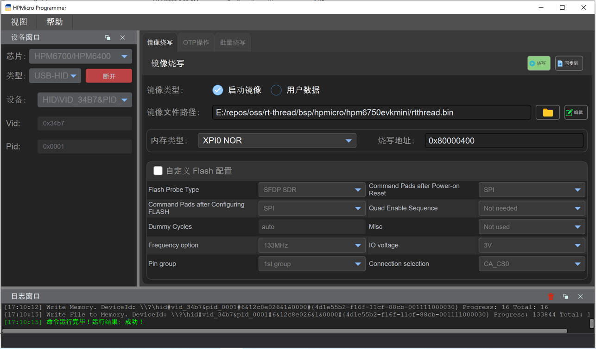
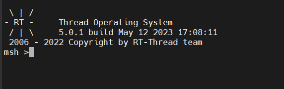

# HPMicro BSP

## 1. 简介

HPMicro BSP为先楫提供的RT-Thread 板级支持包，基于[hpm_sdk](https://github.com/hpmicro/hpm_sdk) 开发。
提供对常用外设的 RT-Thread 驱动支持。

### 芯片支持列表

- HPM67xx
- HPM64xx
- HPM63xx
- HPM62xx

### 目录结构

典型的BSP目录结构如下：

```console
hpmicro
|-- docs
|-- libraries
|-- <board>
    |-- applications
    |-- board
    |-- startup
    |-- rtconfig.h
    |-- rtconfigy.py
    |-- SConscript
    |-- SConstruct
```

## 2. 开发板支持列表

|   开发板                   |  芯片                  |    调试器                |
| :-----------------------  | -----------------------| -----------------------  |
| HPM6750EVKMINI            | HPM6750                |    板载FT2232            |
| HPM6750EVK                | HPM6750                |    板载FT2232            |
| HPM6750EVK2               | HPM6750                |    标准 20-PIN JTAG 接口 |
| HPM6300EVK                | HPM6360                |    板载FT2232            |
| HPM6200EVK                | HPM6280                |    板载FT2232            |

## 3. 驱动支持列表

| 驱动 | 支持情况 | 备注              |
| :--- | :------- | :---------------- |
| UART | 支持     | 默认波特率115200 |
| GPIO | 支持     |                   |
| I2C  | 支持     |                   |
| SPI  | 支持     | 支持DMA            |
| PWM  | 支持     |                   |
| ADC  | 支持     |                   |
| RTC  | 支持     |                   |
| WDT  | 支持     |                   |
| HWTIMER  | 支持 |                   |
| FLASH  | 支持   |                   |
| Audo   | 支持   |                   |
| SDIO   | 支持   |                   |
| USB   |  支持   |                   |
| CAN   |  支持   |                   |
| Ethernet | 支持 |                  |

----

## 4. 环境搭建及编译

### 4.1 Windows系统下的环境搭建与编译

#### 4.1.1 准备工具链

- 下载通用[RISC-V toolchain](https://gitee.com/devinfanyang/hpmicro-toolchain-debugger/blob/master/riscv32-gnu-toolchain-win.zip)并解压到相应的目录，如 `C:\DevTools\riscv32-gnu-toolchain`
- 设置环境变量 `RTT_RISCV_TOOLCHAIN`，如 `C:\DevTools\riscv32-gnu-toolchain\bin`
- 下载 [env 工具](https://www.rt-thread.org/download.html#download-rt-thread-env-tool)

#### 4.1.2 准备调试工具

- 下载[openocd](https://gitee.com/devinfanyang/hpmicro-toolchain-debugger/blob/master/openocd-win.zip)并解压到相应目录，如`C:\DevTools\openocd`
- 将opencod将到系统环境变量中

#### 4.1.3 编译

打开env 工具，在console下进入`bsp/hpmicro/`目录中，以`hpm6750evkmini`开发板为例, 运行:

```console
 cd hpm6750evkmini
 menuconfig
 pkgs --update
```

更新完软件包后，执行 `scons -j10` 或 `scons -j10 --verbose` 来编译这个板级支持包。如果编译正确无误，会产生rtthread.elf、rtthread.bin文件

### 4.2 Linux系统下的环境搭建与编译

### 4.2.1 准备工具链

- 下载通用[RISC-V toolchain](https://gitee.com/devinfanyang/hpmicro-toolchain-debugger/blob/master/riscv32-gnu-toolchain-linux.zip)并解压到相应的目录，如 `${HOME}/DevTools/riscv32-gnu-toolchain`
- 设置环境变量 `RTT_RISCV_TOOLCHAIN`，如 `export RTT_RISCV_TOOLCHAIN=${HOME}/DevTools/riscv32-gnu-toolchain/bin`

#### 4.2.2 准备调试工具

- 下载[openocd](https://gitee.com/devinfanyang/hpmicro-toolchain-debugger/blob/master/openocd-linux.zip)并解压到相应目录，如`${HOME}/DevTools/openocd`
- 将opencod将到系统环境变量中, 如 `export PATH=$PATH:${HOME}/DevTools/openocd`

### 4.2.3 编译

先执行：

```shell
    cd bsp/hpmicro/hpm6750evkmini
    scons --menuconfig
```

它会自动下载env相关脚本到~/.env目录，然后执行

```shell
    source ~/.env/env.sh

    cd bsp/bouffalo_lab/bl61x
    pkgs --update
```

更新完软件包后，执行 `scons -j10` 或 `scons -j10 --verbose` 来编译这个板级支持包。如果编译正确无误，会产生rtthread.elf、rtthread.bin文件

## 5. 下载

### 5.1 通过openocd 下载

以`hpm6750evkmini`为例:

将开发板`BOOT`引脚拨为 0-OFF，1-ON，按一下复位键

```shell
cd bsp/hpmicro/hpm6750evkmini
openocd -f board/debug_scripts/openocd/probes/ft2232.cfg -f board/debug_scripts/openocd/soc/hpm6750-single-core.cfg -f board/debug_scripts/openocd/boards/hpm6750evkmini.cfg -c "init; halt; flash write_image erase rtthread.elf; reset; shutdown"
```

将开发板`BOOT`引脚拨为 0-OFF，1-OFF，按一下复位键

### 5.2 通过烧写工具下载

1. 将开发板`BOOT`引脚拨到 1-OFF, 2-ON
2. 连接好串口或USB口
3. 选择对应的芯片，点击“连接”
4. 在“镜像烧写”窗口，选择 "rtthread.bin"作为启动镜像
5. 点击“烧写”完成烧写

烧写完成的界面如图


## 6. 运行

如果编译 & 烧写无误，当复位设备后，会在串口上看到RT-Thread的启动logo信息：



## 7. 调试

### 方式一：通过　openocd + riscv32-unknown-elf-gdb 来调试

以 `hpm6750evkmini`为例:

- 建立 gdb server

```shell
cd bsp/hpmicro/hpm6750evkmini
openocd -f board/debug_scripts/openocd/probes/ft2232.cfg -f board/debug_scripts/openocd/soc/hpm6750-single-core.cfg -f board/debug_scripts/openocd/boards/hpm6750evkmini.cfg
```

- 开启gdb 调试：

``` shell
riscv32-unknown-elf-gdb rtthread.elf
>> target remote :3333
>> load
>> c
```

- 详细的GDB的用法请自行百度

### 方式二： 使用`Ozone` 加载`rtthread.elf` 配合 `JLink` 来调试

- 详情请参考Ozone使用手册

## 8. 联系人信息

维护人：[helloeagleyang](https://github.com/helloeagleyang)

## 9. 参考

- 先楫官方资源
  - 官方网站：<https://www.hpmicro.com>
  - 官方仓库：
    - GitHub: <https://github.com/hpmicro>
    - Gitee: <https://gitee.com/hpmicro>
